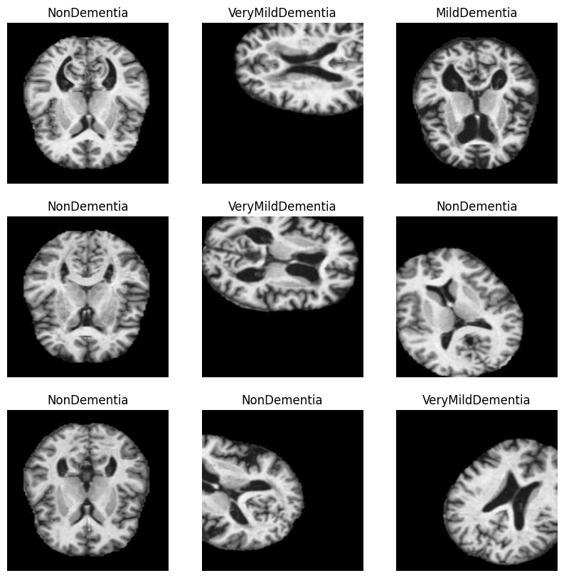
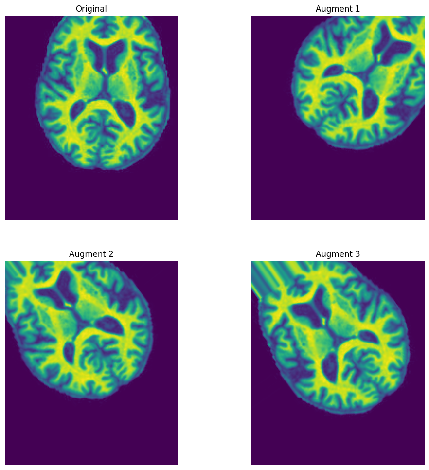
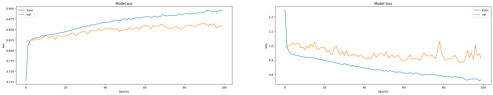

## Imports
All the necessary libraries
- tensorflow (tf)
    - a machine learning framework
- PIL (Python Image Library) 
    - to look at images easily
- Numpy (np)
    - convert images to matrices and other math functions
- keras
    - high level API to interface with tf and perform ML tasks
- Matplotlib
    - to plot relevant data and show images
- Technically Jupyter Notebook
    - enabled live scripting for easy coding and testing


data:
https://www.kaggle.com/datasets/tourist55/alzheimers-dataset-4-class-of-images


```python
from PIL import Image
import tensorflow as tf
from keras import Sequential, layers
import keras
import os
import matplotlib.pyplot as plt
import numpy as np

```


    ---------------------------------------------------------------------------

    ModuleNotFoundError                       Traceback (most recent call last)

    Cell In[1], line 2
          1 from PIL import Image
    ----> 2 import tensorflow as tf
          3 from keras import Sequential, layers
          4 import keras
    

    ModuleNotFoundError: No module named 'tensorflow'


## Preproccessing

we have to convert all images to 224px x 224px. (not here though)
using keras we split the data into a training dataset and validating dataset
**this is important as we can not test on data we trained the model with**

The bottom code is just to show the images while I was writing the code


```python
from tensorflow.python.data import AUTOTUNE

img_size = (224,224)


train_ds = keras.utils.image_dataset_from_directory(
    directory='Alzheimer_s Dataset/train',
    labels='inferred',
    # label_mode='categorical',
    batch_size=16,
    image_size=img_size)
validation_ds = keras.utils.image_dataset_from_directory(
    directory='Alzheimer_s Dataset/test',
    labels='inferred',
    # label_mode='categorical',
    batch_size=16,
    image_size=img_size)

# batch_1=train_ds.take(1)


def one_hot_label(image, label):
    label = tf.one_hot(label, 4)
    return image, label

train_ds = train_ds.map(one_hot_label, num_parallel_calls=AUTOTUNE)
validation_ds = validation_ds.map(one_hot_label, num_parallel_calls=AUTOTUNE)


class_names = ['MildDementia', 'ModerateDementia', 'NonDementia', 'VeryMildDementia']
train_ds.class_names = class_names
validation_ds.class_names = class_names

plt.figure(figsize=(10, 10))
for images, labels in train_ds.take(1):
  for i in range(9):
    ax = plt.subplot(3, 3, i + 1)
    plt.imshow(images[i].numpy().astype("uint8"))
    plt.title(train_ds.class_names[list(labels[i].numpy()).index(1)])
    plt.axis("off")
```

    Found 11259 files belonging to 4 classes.
    

    2023-11-25 15:54:12.863935: I tensorflow/compiler/xla/stream_executor/cuda/cuda_gpu_executor.cc:880] could not open file to read NUMA node: /sys/bus/pci/devices/0000:07:00.0/numa_node
    Your kernel may have been built without NUMA support.
    2023-11-25 15:54:12.866518: I tensorflow/compiler/xla/stream_executor/cuda/cuda_gpu_executor.cc:880] could not open file to read NUMA node: /sys/bus/pci/devices/0000:07:00.0/numa_node
    Your kernel may have been built without NUMA support.
    2023-11-25 15:54:12.866544: I tensorflow/compiler/xla/stream_executor/cuda/cuda_gpu_executor.cc:880] could not open file to read NUMA node: /sys/bus/pci/devices/0000:07:00.0/numa_node
    Your kernel may have been built without NUMA support.
    2023-11-25 15:54:12.867001: I tensorflow/compiler/xla/stream_executor/cuda/cuda_gpu_executor.cc:880] could not open file to read NUMA node: /sys/bus/pci/devices/0000:07:00.0/numa_node
    Your kernel may have been built without NUMA support.
    2023-11-25 15:54:12.867023: I tensorflow/compiler/xla/stream_executor/cuda/cuda_gpu_executor.cc:880] could not open file to read NUMA node: /sys/bus/pci/devices/0000:07:00.0/numa_node
    Your kernel may have been built without NUMA support.
    2023-11-25 15:54:12.867038: I tensorflow/compiler/xla/stream_executor/cuda/cuda_gpu_executor.cc:880] could not open file to read NUMA node: /sys/bus/pci/devices/0000:07:00.0/numa_node
    Your kernel may have been built without NUMA support.
    2023-11-25 15:54:12.979404: I tensorflow/compiler/xla/stream_executor/cuda/cuda_gpu_executor.cc:880] could not open file to read NUMA node: /sys/bus/pci/devices/0000:07:00.0/numa_node
    Your kernel may have been built without NUMA support.
    2023-11-25 15:54:12.979443: I tensorflow/compiler/xla/stream_executor/cuda/cuda_gpu_executor.cc:880] could not open file to read NUMA node: /sys/bus/pci/devices/0000:07:00.0/numa_node
    Your kernel may have been built without NUMA support.
    2023-11-25 15:54:12.979449: I tensorflow/core/common_runtime/gpu/gpu_device.cc:1977] Could not identify NUMA node of platform GPU id 0, defaulting to 0.  Your kernel may not have been built with NUMA support.
    2023-11-25 15:54:12.979472: I tensorflow/compiler/xla/stream_executor/cuda/cuda_gpu_executor.cc:880] could not open file to read NUMA node: /sys/bus/pci/devices/0000:07:00.0/numa_node
    Your kernel may have been built without NUMA support.
    2023-11-25 15:54:12.979486: I tensorflow/core/common_runtime/gpu/gpu_device.cc:1886] Created device /job:localhost/replica:0/task:0/device:GPU:0 with 5578 MB memory:  -> device: 0, name: NVIDIA GeForce RTX 3070, pci bus id: 0000:07:00.0, compute capability: 8.6
    2023-11-25 15:54:17.446148: I tensorflow/tsl/platform/default/subprocess.cc:304] Start cannot spawn child process: No such file or directory
    

    Found 1279 files belonging to 4 classes.
    


    

    


We normalize the data to 0-1 from 0-255


```python
class_names = train_ds.class_names
print(class_names)

normalization_layer = layers.Rescaling(1./255)
normalized_ds = train_ds.map(lambda x, y: (normalization_layer(x), y))
image_batch, labels_batch = next(iter(normalized_ds))
first_image = image_batch[0]
# Notice the pixel values are now in `[0,1]`.
print(np.min(first_image), np.max(first_image))

```

    ['MildDementia', 'ModerateDementia', 'NonDementia', 'VeryMildDementia']
    0.0 0.9939727
    

## Data augmentation

This is to expand or dataset and add variance, so the dataset is not over-fitted to our certain set of images. We wrote a function to do this in a separate file for readability. The function takes in a directory with images and outputs the original image and 3 augmented images. These augmented images have been rotated, flipped horizontally and vertically, shift in both the X and Y direction, and a shift transformation.


```python
from Augment import load_and_augment
from PIL import Image
import os
import matplotlib.pyplot as plt

starting_dir = "Alzheimer_s Dataset/train"
image_labels = ["Original", "Augment 1", "Augment 2", "Augment 3"]
labels = os.listdir(starting_dir)
for label in labels:
    curr_dir = os.path.join(starting_dir, label)
    # print(curr_dir)
    augmented_imgs = load_and_augment(curr_dir, .01)
    plt.figure(figsize=(12, 12))
    plt.subplot(2,2,4)
    print("iter")
    i = 0
    for i, img in enumerate(augmented_imgs):
        # plt.figure(figsize=(12, 12))
        # i += 1
        plt.subplot(2,2,i+1)
        plt.title(image_labels[i])
        plt.imshow(img)
        plt.axis('off')


    plt.tight_layout()
    plt.show()
        
    

```

    Alzheimer_s Dataset/train/MildDemented
    Saved augmented image: Alzheimer_s Dataset/train/MildDemented/mildDem366_augment(1)_augment(0).jpg
    Saved augmented image: Alzheimer_s Dataset/train/MildDemented/mildDem366_augment(1)_augment(1).jpg
    Saved augmented image: Alzheimer_s Dataset/train/MildDemented/mildDem366_augment(1)_augment(2).jpg
    Saved augmented image: Alzheimer_s Dataset/train/MildDemented/mildDem368_augment(0).jpg
    Saved augmented image: Alzheimer_s Dataset/train/MildDemented/mildDem368_augment(1).jpg
    Saved augmented image: Alzheimer_s Dataset/train/MildDemented/mildDem368_augment(2).jpg
    Saved augmented image: Alzheimer_s Dataset/train/MildDemented/mildDem402_augment(1)_augment(0).jpg
    Saved augmented image: Alzheimer_s Dataset/train/MildDemented/mildDem402_augment(1)_augment(1).jpg
    Saved augmented image: Alzheimer_s Dataset/train/MildDemented/mildDem402_augment(1)_augment(2).jpg
    Saved augmented image: Alzheimer_s Dataset/train/MildDemented/mildDem393_augment(1)_augment(0).jpg
    Saved augmented image: Alzheimer_s Dataset/train/MildDemented/mildDem393_augment(1)_augment(1).jpg
    Saved augmented image: Alzheimer_s Dataset/train/MildDemented/mildDem393_augment(1)_augment(2).jpg
    Saved augmented image: Alzheimer_s Dataset/train/MildDemented/mildDem265_augment(0)_augment(0).jpg
    Saved augmented image: Alzheimer_s Dataset/train/MildDemented/mildDem265_augment(0)_augment(1).jpg
    Saved augmented image: Alzheimer_s Dataset/train/MildDemented/mildDem265_augment(0)_augment(2).jpg
    Saved augmented image: Alzheimer_s Dataset/train/MildDemented/mildDem84_augment(2)_augment(0).jpg
    Saved augmented image: Alzheimer_s Dataset/train/MildDemented/mildDem84_augment(2)_augment(1).jpg
    Saved augmented image: Alzheimer_s Dataset/train/MildDemented/mildDem84_augment(2)_augment(2).jpg
    Saved augmented image: Alzheimer_s Dataset/train/MildDemented/mildDem594_augment(0).jpg
    Saved augmented image: Alzheimer_s Dataset/train/MildDemented/mildDem594_augment(1).jpg
    Saved augmented image: Alzheimer_s Dataset/train/MildDemented/mildDem594_augment(2).jpg
    Saved augmented image: Alzheimer_s Dataset/train/MildDemented/mildDem430_augment(0)_augment(0).jpg
    Saved augmented image: Alzheimer_s Dataset/train/MildDemented/mildDem430_augment(0)_augment(1).jpg
    Saved augmented image: Alzheimer_s Dataset/train/MildDemented/mildDem430_augment(0)_augment(2).jpg
    Saved augmented image: Alzheimer_s Dataset/train/MildDemented/mildDem219_augment(0).jpg
    Saved augmented image: Alzheimer_s Dataset/train/MildDemented/mildDem219_augment(1).jpg
    Saved augmented image: Alzheimer_s Dataset/train/MildDemented/mildDem219_augment(2).jpg
    Saved augmented image: Alzheimer_s Dataset/train/MildDemented/mildDem456_augment(0).jpg
    Saved augmented image: Alzheimer_s Dataset/train/MildDemented/mildDem456_augment(1).jpg
    Saved augmented image: Alzheimer_s Dataset/train/MildDemented/mildDem456_augment(2).jpg
    Saved augmented image: Alzheimer_s Dataset/train/MildDemented/mildDem194_augment(2)_augment(0).jpg
    Saved augmented image: Alzheimer_s Dataset/train/MildDemented/mildDem194_augment(2)_augment(1).jpg
    Saved augmented image: Alzheimer_s Dataset/train/MildDemented/mildDem194_augment(2)_augment(2).jpg
    Saved augmented image: Alzheimer_s Dataset/train/MildDemented/mildDem40_augment(0).jpg
    Saved augmented image: Alzheimer_s Dataset/train/MildDemented/mildDem40_augment(1).jpg
    Saved augmented image: Alzheimer_s Dataset/train/MildDemented/mildDem40_augment(2).jpg
    Saved augmented image: Alzheimer_s Dataset/train/MildDemented/mildDem160_augment(0).jpg
    Saved augmented image: Alzheimer_s Dataset/train/MildDemented/mildDem160_augment(1).jpg
    Saved augmented image: Alzheimer_s Dataset/train/MildDemented/mildDem160_augment(2).jpg
    Saved augmented image: Alzheimer_s Dataset/train/MildDemented/mildDem645_augment(0).jpg
    Saved augmented image: Alzheimer_s Dataset/train/MildDemented/mildDem645_augment(1).jpg
    Saved augmented image: Alzheimer_s Dataset/train/MildDemented/mildDem645_augment(2).jpg
    Saved augmented image: Alzheimer_s Dataset/train/MildDemented/mildDem39_augment(0)_augment(0).jpg
    Saved augmented image: Alzheimer_s Dataset/train/MildDemented/mildDem39_augment(0)_augment(1).jpg
    Saved augmented image: Alzheimer_s Dataset/train/MildDemented/mildDem39_augment(0)_augment(2).jpg
    iter
    


    ---------------------------------------------------------------------------

    ValueError                                Traceback (most recent call last)

    Cell In[6], line 20
         16 i = 0
         17 for i, img in enumerate(augmented_imgs):
         18     # plt.figure(figsize=(12, 12))
         19     # i += 1
    ---> 20     plt.subplot(2,2,i+1)
         21     plt.title(image_labels[i])
         22     plt.imshow(img)
    

    File ~/.virtualenvs/BME240_ML/lib/python3.10/site-packages/matplotlib/pyplot.py:1425, in subplot(*args, **kwargs)
       1422 fig = gcf()
       1424 # First, search for an existing subplot with a matching spec.
    -> 1425 key = SubplotSpec._from_subplot_args(fig, args)
       1427 for ax in fig.axes:
       1428     # If we found an Axes at the position, we can re-use it if the user passed no
       1429     # kwargs or if the axes class and kwargs are identical.
       1430     if (ax.get_subplotspec() == key
       1431         and (kwargs == {}
       1432              or (ax._projection_init
       1433                  == fig._process_projection_requirements(**kwargs)))):
    

    File ~/.virtualenvs/BME240_ML/lib/python3.10/site-packages/matplotlib/gridspec.py:599, in SubplotSpec._from_subplot_args(figure, args)
        597 else:
        598     if not isinstance(num, Integral) or num < 1 or num > rows*cols:
    --> 599         raise ValueError(
        600             f"num must be an integer with 1 <= num <= {rows*cols}, "
        601             f"not {num!r}"
        602         )
        603     i = j = num
        604 return gs[i-1:j]
    

    ValueError: num must be an integer with 1 <= num <= 4, not 5


    

    


## Defining the Model

here we utilize InceptionV3 as a base architecture  as a good starting point.

then we define a keras model which takes the 1000 classes from mobilenet and cuts it down to 4 which represent our 4 classes

input: resized images --- MobileNet w imagenet weights --> 1000 classes --- Dense layer --> our 4 classes


```python
from keras.src.applications import InceptionV3

num_classes = len(class_names)

model_MN = InceptionV3(input_shape=(224, 224, 3), include_top=False, weights="imagenet")

model_MN.trainable = False

model = keras.Sequential([
        model_MN,
       layers. Dropout(0.5),
       layers. GlobalAveragePooling2D(),
       layers. Flatten(),
      layers.  BatchNormalization(),
      layers.  Dense(512, activation='relu'),
      layers.  BatchNormalization(),
      layers.  Dropout(0.5),
      layers.  Dense(256, activation='relu'),
      layers.  BatchNormalization(),
      layers.  Dropout(0.5),
      layers.  Dense(128, activation='relu'),
      layers.  BatchNormalization(),
      layers.  Dropout(0.5),
      layers.  Dense(64, activation='relu'),
      layers.  Dropout(0.5),
       layers. BatchNormalization(),
      layers.  Dense(4, activation='softmax')   
])

model.build(img_size)

```

here im just compiling the model

AUC stands for Area-Under-the-Curve.


```python
METRICS = [tf.keras.metrics.AUC(name='auc'), "acc"]

model.compile(optimizer='adam',loss=tf.losses.CategoricalCrossentropy(),
              # loss=tf.keras.losses.SparseCategoricalCrossentropy(from_logits=True),
              metrics=METRICS)

```


```python
model.summary()
```

    Model: "sequential_6"
    _________________________________________________________________
     Layer (type)                Output Shape              Param #   
    =================================================================
     inception_v3 (Functional)   (None, 5, 5, 2048)        21802784  
                                                                     
     dropout_2 (Dropout)         (None, 5, 5, 2048)        0         
                                                                     
     global_average_pooling2d_3  (None, 2048)              0         
      (GlobalAveragePooling2D)                                       
                                                                     
     flatten (Flatten)           (None, 2048)              0         
                                                                     
     batch_normalization_566 (B  (None, 2048)              8192      
     atchNormalization)                                              
                                                                     
     dense_12 (Dense)            (None, 512)               1049088   
                                                                     
     batch_normalization_567 (B  (None, 512)               2048      
     atchNormalization)                                              
                                                                     
     dropout_3 (Dropout)         (None, 512)               0         
                                                                     
     dense_13 (Dense)            (None, 256)               131328    
                                                                     
     batch_normalization_568 (B  (None, 256)               1024      
     atchNormalization)                                              
                                                                     
     dropout_4 (Dropout)         (None, 256)               0         
                                                                     
     dense_14 (Dense)            (None, 128)               32896     
                                                                     
     batch_normalization_569 (B  (None, 128)               512       
     atchNormalization)                                              
                                                                     
     dropout_5 (Dropout)         (None, 128)               0         
                                                                     
     dense_15 (Dense)            (None, 64)                8256      
                                                                     
     dropout_6 (Dropout)         (None, 64)                0         
                                                                     
     batch_normalization_570 (B  (None, 64)                256       
     atchNormalization)                                              
                                                                     
     dense_16 (Dense)            (None, 4)                 260       
                                                                     
    =================================================================
    Total params: 23036644 (87.88 MB)
    Trainable params: 1227844 (4.68 MB)
    Non-trainable params: 21808800 (83.19 MB)
    _________________________________________________________________
    

epochs is how many times the model trains on every image in the training set

and then I fit the network to the training set


```python
epochs=100
fit_md = model.fit(
  train_ds,
  validation_data=validation_ds,
  epochs=epochs                                                                                             
)

```

    Epoch 1/100
    

    2023-11-25 15:54:59.561431: I tensorflow/compiler/xla/stream_executor/cuda/cuda_dnn.cc:442] Loaded cuDNN version 8700
    2023-11-25 15:54:59.814934: I tensorflow/tsl/platform/default/subprocess.cc:304] Start cannot spawn child process: No such file or directory
    2023-11-25 15:55:02.091337: I tensorflow/compiler/xla/service/service.cc:168] XLA service 0x563bfde44750 initialized for platform CUDA (this does not guarantee that XLA will be used). Devices:
    2023-11-25 15:55:02.091364: I tensorflow/compiler/xla/service/service.cc:176]   StreamExecutor device (0): NVIDIA GeForce RTX 3070, Compute Capability 8.6
    2023-11-25 15:55:02.098364: I tensorflow/compiler/mlir/tensorflow/utils/dump_mlir_util.cc:269] disabling MLIR crash reproducer, set env var `MLIR_CRASH_REPRODUCER_DIRECTORY` to enable.
    2023-11-25 15:55:02.158358: I ./tensorflow/compiler/jit/device_compiler.h:186] Compiled cluster using XLA!  This line is logged at most once for the lifetime of the process.
    

    704/704 [==============================] - 34s 39ms/step - loss: 1.2476 - auc: 0.7279 - acc: 0.4407 - val_loss: 0.9872 - val_auc: 0.8196 - val_acc: 0.5207
    Epoch 2/100
    704/704 [==============================] - 25s 35ms/step - loss: 0.9914 - auc: 0.8109 - acc: 0.5220 - val_loss: 0.9952 - val_auc: 0.8240 - val_acc: 0.5223
    Epoch 3/100
    704/704 [==============================] - 25s 35ms/step - loss: 0.9589 - auc: 0.8214 - acc: 0.5347 - val_loss: 0.9987 - val_auc: 0.8221 - val_acc: 0.5278
    Epoch 4/100
    704/704 [==============================] - 25s 35ms/step - loss: 0.9428 - auc: 0.8268 - acc: 0.5387 - val_loss: 1.0055 - val_auc: 0.8258 - val_acc: 0.5332
    Epoch 5/100
    704/704 [==============================] - 25s 35ms/step - loss: 0.9405 - auc: 0.8288 - acc: 0.5450 - val_loss: 1.0202 - val_auc: 0.8242 - val_acc: 0.5317
    Epoch 6/100
    704/704 [==============================] - 25s 35ms/step - loss: 0.9348 - auc: 0.8300 - acc: 0.5464 - val_loss: 1.0082 - val_auc: 0.8282 - val_acc: 0.5364
    Epoch 7/100
    704/704 [==============================] - 25s 35ms/step - loss: 0.9327 - auc: 0.8311 - acc: 0.5486 - val_loss: 1.0147 - val_auc: 0.8269 - val_acc: 0.5262
    Epoch 8/100
    704/704 [==============================] - 24s 35ms/step - loss: 0.9313 - auc: 0.8312 - acc: 0.5531 - val_loss: 1.0136 - val_auc: 0.8258 - val_acc: 0.5348
    Epoch 9/100
    704/704 [==============================] - 24s 35ms/step - loss: 0.9231 - auc: 0.8355 - acc: 0.5596 - val_loss: 0.9837 - val_auc: 0.8303 - val_acc: 0.5332
    Epoch 10/100
    704/704 [==============================] - 24s 35ms/step - loss: 0.9233 - auc: 0.8341 - acc: 0.5487 - val_loss: 0.9920 - val_auc: 0.8321 - val_acc: 0.5457
    Epoch 11/100
    704/704 [==============================] - 24s 35ms/step - loss: 0.9192 - auc: 0.8365 - acc: 0.5538 - val_loss: 0.9701 - val_auc: 0.8353 - val_acc: 0.5481
    Epoch 12/100
    704/704 [==============================] - 25s 35ms/step - loss: 0.9186 - auc: 0.8364 - acc: 0.5537 - val_loss: 0.9972 - val_auc: 0.8322 - val_acc: 0.5489
    Epoch 13/100
    704/704 [==============================] - 24s 35ms/step - loss: 0.9189 - auc: 0.8375 - acc: 0.5589 - val_loss: 0.9849 - val_auc: 0.8309 - val_acc: 0.5301
    Epoch 14/100
    704/704 [==============================] - 24s 34ms/step - loss: 0.9161 - auc: 0.8374 - acc: 0.5567 - val_loss: 1.0093 - val_auc: 0.8332 - val_acc: 0.5489
    Epoch 15/100
    704/704 [==============================] - 24s 34ms/step - loss: 0.9163 - auc: 0.8378 - acc: 0.5578 - val_loss: 0.9914 - val_auc: 0.8322 - val_acc: 0.5410
    Epoch 16/100
    704/704 [==============================] - 24s 34ms/step - loss: 0.9133 - auc: 0.8392 - acc: 0.5583 - val_loss: 1.0272 - val_auc: 0.8263 - val_acc: 0.5207
    Epoch 17/100
    704/704 [==============================] - 24s 34ms/step - loss: 0.9079 - auc: 0.8403 - acc: 0.5592 - val_loss: 0.9743 - val_auc: 0.8352 - val_acc: 0.5450
    Epoch 18/100
    704/704 [==============================] - 24s 34ms/step - loss: 0.9070 - auc: 0.8419 - acc: 0.5596 - val_loss: 0.9749 - val_auc: 0.8358 - val_acc: 0.5481
    Epoch 19/100
    704/704 [==============================] - 24s 34ms/step - loss: 0.9014 - auc: 0.8427 - acc: 0.5636 - val_loss: 0.9864 - val_auc: 0.8324 - val_acc: 0.5285
    Epoch 20/100
    704/704 [==============================] - 24s 34ms/step - loss: 0.9029 - auc: 0.8429 - acc: 0.5635 - val_loss: 0.9873 - val_auc: 0.8335 - val_acc: 0.5418
    Epoch 21/100
    704/704 [==============================] - 24s 34ms/step - loss: 0.8949 - auc: 0.8455 - acc: 0.5674 - val_loss: 0.9862 - val_auc: 0.8340 - val_acc: 0.5395
    Epoch 22/100
    704/704 [==============================] - 24s 34ms/step - loss: 0.8953 - auc: 0.8453 - acc: 0.5634 - val_loss: 0.9563 - val_auc: 0.8373 - val_acc: 0.5512
    Epoch 23/100
    704/704 [==============================] - 24s 34ms/step - loss: 0.8888 - auc: 0.8479 - acc: 0.5715 - val_loss: 0.9669 - val_auc: 0.8372 - val_acc: 0.5457
    Epoch 24/100
    704/704 [==============================] - 24s 34ms/step - loss: 0.8928 - auc: 0.8473 - acc: 0.5714 - val_loss: 0.9424 - val_auc: 0.8411 - val_acc: 0.5575
    Epoch 25/100
    704/704 [==============================] - 24s 34ms/step - loss: 0.8853 - auc: 0.8504 - acc: 0.5773 - val_loss: 0.9401 - val_auc: 0.8414 - val_acc: 0.5614
    Epoch 26/100
    704/704 [==============================] - 24s 34ms/step - loss: 0.8823 - auc: 0.8507 - acc: 0.5752 - val_loss: 0.9915 - val_auc: 0.8353 - val_acc: 0.5496
    Epoch 27/100
    704/704 [==============================] - 24s 34ms/step - loss: 0.8794 - auc: 0.8522 - acc: 0.5749 - val_loss: 0.9972 - val_auc: 0.8370 - val_acc: 0.5496
    Epoch 28/100
    704/704 [==============================] - 24s 34ms/step - loss: 0.8760 - auc: 0.8540 - acc: 0.5820 - val_loss: 0.9520 - val_auc: 0.8419 - val_acc: 0.5489
    Epoch 29/100
    704/704 [==============================] - 24s 34ms/step - loss: 0.8720 - auc: 0.8547 - acc: 0.5875 - val_loss: 0.9365 - val_auc: 0.8434 - val_acc: 0.5528
    Epoch 30/100
    704/704 [==============================] - 24s 34ms/step - loss: 0.8684 - auc: 0.8571 - acc: 0.5878 - val_loss: 0.9608 - val_auc: 0.8453 - val_acc: 0.5676
    Epoch 31/100
    704/704 [==============================] - 24s 34ms/step - loss: 0.8758 - auc: 0.8550 - acc: 0.5850 - val_loss: 0.9310 - val_auc: 0.8448 - val_acc: 0.5551
    Epoch 32/100
    704/704 [==============================] - 24s 34ms/step - loss: 0.8666 - auc: 0.8585 - acc: 0.5854 - val_loss: 0.9669 - val_auc: 0.8394 - val_acc: 0.5442
    Epoch 33/100
    704/704 [==============================] - 24s 34ms/step - loss: 0.8688 - auc: 0.8576 - acc: 0.5853 - val_loss: 0.9286 - val_auc: 0.8442 - val_acc: 0.5582
    Epoch 34/100
    704/704 [==============================] - 24s 34ms/step - loss: 0.8578 - auc: 0.8616 - acc: 0.5968 - val_loss: 0.9318 - val_auc: 0.8480 - val_acc: 0.5794
    Epoch 35/100
    704/704 [==============================] - 24s 34ms/step - loss: 0.8626 - auc: 0.8606 - acc: 0.5957 - val_loss: 0.9411 - val_auc: 0.8466 - val_acc: 0.5668
    Epoch 36/100
    704/704 [==============================] - 24s 34ms/step - loss: 0.8584 - auc: 0.8617 - acc: 0.5973 - val_loss: 0.9313 - val_auc: 0.8474 - val_acc: 0.5747
    Epoch 37/100
    704/704 [==============================] - 24s 34ms/step - loss: 0.8533 - auc: 0.8631 - acc: 0.5984 - val_loss: 0.9373 - val_auc: 0.8485 - val_acc: 0.5809
    Epoch 38/100
    704/704 [==============================] - 24s 34ms/step - loss: 0.8574 - auc: 0.8635 - acc: 0.6025 - val_loss: 0.9219 - val_auc: 0.8519 - val_acc: 0.5927
    Epoch 39/100
    704/704 [==============================] - 24s 34ms/step - loss: 0.8491 - auc: 0.8658 - acc: 0.6058 - val_loss: 0.9390 - val_auc: 0.8465 - val_acc: 0.5567
    Epoch 40/100
    704/704 [==============================] - 24s 34ms/step - loss: 0.8478 - auc: 0.8662 - acc: 0.6065 - val_loss: 0.9252 - val_auc: 0.8487 - val_acc: 0.5629
    Epoch 41/100
    704/704 [==============================] - 24s 34ms/step - loss: 0.8448 - auc: 0.8663 - acc: 0.6044 - val_loss: 0.9147 - val_auc: 0.8526 - val_acc: 0.5794
    Epoch 42/100
    704/704 [==============================] - 24s 34ms/step - loss: 0.8447 - auc: 0.8666 - acc: 0.6082 - val_loss: 0.9052 - val_auc: 0.8519 - val_acc: 0.5833
    Epoch 43/100
    704/704 [==============================] - 24s 34ms/step - loss: 0.8427 - auc: 0.8674 - acc: 0.6072 - val_loss: 0.9180 - val_auc: 0.8507 - val_acc: 0.5786
    Epoch 44/100
    704/704 [==============================] - 24s 34ms/step - loss: 0.8382 - auc: 0.8690 - acc: 0.6136 - val_loss: 0.9089 - val_auc: 0.8536 - val_acc: 0.5841
    Epoch 45/100
    704/704 [==============================] - 24s 34ms/step - loss: 0.8359 - auc: 0.8699 - acc: 0.6140 - val_loss: 0.9234 - val_auc: 0.8507 - val_acc: 0.5817
    Epoch 46/100
    704/704 [==============================] - 24s 34ms/step - loss: 0.8295 - auc: 0.8722 - acc: 0.6141 - val_loss: 0.9474 - val_auc: 0.8498 - val_acc: 0.5762
    Epoch 47/100
    704/704 [==============================] - 24s 34ms/step - loss: 0.8347 - auc: 0.8714 - acc: 0.6159 - val_loss: 0.9199 - val_auc: 0.8526 - val_acc: 0.5809
    Epoch 48/100
    704/704 [==============================] - 24s 34ms/step - loss: 0.8316 - auc: 0.8715 - acc: 0.6164 - val_loss: 0.9398 - val_auc: 0.8457 - val_acc: 0.5598
    Epoch 49/100
    704/704 [==============================] - 24s 34ms/step - loss: 0.8323 - auc: 0.8706 - acc: 0.6114 - val_loss: 0.9448 - val_auc: 0.8475 - val_acc: 0.5841
    Epoch 50/100
    704/704 [==============================] - 24s 34ms/step - loss: 0.8260 - auc: 0.8743 - acc: 0.6168 - val_loss: 0.9441 - val_auc: 0.8474 - val_acc: 0.5692
    Epoch 51/100
    704/704 [==============================] - 24s 34ms/step - loss: 0.8222 - auc: 0.8752 - acc: 0.6196 - val_loss: 0.9300 - val_auc: 0.8509 - val_acc: 0.5966
    Epoch 52/100
    704/704 [==============================] - 24s 34ms/step - loss: 0.8297 - auc: 0.8727 - acc: 0.6194 - val_loss: 0.9605 - val_auc: 0.8486 - val_acc: 0.5934
    Epoch 53/100
    704/704 [==============================] - 24s 34ms/step - loss: 0.8192 - auc: 0.8765 - acc: 0.6253 - val_loss: 0.9157 - val_auc: 0.8549 - val_acc: 0.6114
    Epoch 54/100
    704/704 [==============================] - 24s 34ms/step - loss: 0.8276 - auc: 0.8740 - acc: 0.6276 - val_loss: 0.9233 - val_auc: 0.8514 - val_acc: 0.5848
    Epoch 55/100
    704/704 [==============================] - 24s 34ms/step - loss: 0.8214 - auc: 0.8761 - acc: 0.6295 - val_loss: 0.9358 - val_auc: 0.8501 - val_acc: 0.5801
    Epoch 56/100
    704/704 [==============================] - 24s 34ms/step - loss: 0.8195 - auc: 0.8768 - acc: 0.6309 - val_loss: 0.9164 - val_auc: 0.8532 - val_acc: 0.5973
    Epoch 57/100
    704/704 [==============================] - 24s 34ms/step - loss: 0.8149 - auc: 0.8776 - acc: 0.6287 - val_loss: 0.9251 - val_auc: 0.8550 - val_acc: 0.5981
    Epoch 58/100
    704/704 [==============================] - 24s 34ms/step - loss: 0.8179 - auc: 0.8778 - acc: 0.6345 - val_loss: 0.9348 - val_auc: 0.8494 - val_acc: 0.5723
    Epoch 59/100
    704/704 [==============================] - 24s 34ms/step - loss: 0.8179 - auc: 0.8770 - acc: 0.6315 - val_loss: 0.9132 - val_auc: 0.8543 - val_acc: 0.5950
    Epoch 60/100
    704/704 [==============================] - 24s 34ms/step - loss: 0.8125 - auc: 0.8793 - acc: 0.6353 - val_loss: 0.8953 - val_auc: 0.8582 - val_acc: 0.6122
    Epoch 61/100
    704/704 [==============================] - 24s 34ms/step - loss: 0.8101 - auc: 0.8798 - acc: 0.6346 - val_loss: 0.8960 - val_auc: 0.8589 - val_acc: 0.6122
    Epoch 62/100
    704/704 [==============================] - 24s 34ms/step - loss: 0.8093 - auc: 0.8799 - acc: 0.6283 - val_loss: 0.8981 - val_auc: 0.8587 - val_acc: 0.6028
    Epoch 63/100
    704/704 [==============================] - 24s 34ms/step - loss: 0.8060 - auc: 0.8809 - acc: 0.6365 - val_loss: 0.9133 - val_auc: 0.8566 - val_acc: 0.6005
    Epoch 64/100
    704/704 [==============================] - 24s 34ms/step - loss: 0.8132 - auc: 0.8784 - acc: 0.6296 - val_loss: 0.9362 - val_auc: 0.8512 - val_acc: 0.5841
    Epoch 65/100
    704/704 [==============================] - 24s 34ms/step - loss: 0.8080 - auc: 0.8802 - acc: 0.6349 - val_loss: 0.9077 - val_auc: 0.8589 - val_acc: 0.6067
    Epoch 66/100
    704/704 [==============================] - 24s 34ms/step - loss: 0.8030 - auc: 0.8818 - acc: 0.6378 - val_loss: 0.9093 - val_auc: 0.8581 - val_acc: 0.6052
    Epoch 67/100
    704/704 [==============================] - 24s 34ms/step - loss: 0.8121 - auc: 0.8785 - acc: 0.6272 - val_loss: 0.9127 - val_auc: 0.8578 - val_acc: 0.6059
    Epoch 68/100
    704/704 [==============================] - 24s 34ms/step - loss: 0.8046 - auc: 0.8812 - acc: 0.6320 - val_loss: 0.9086 - val_auc: 0.8583 - val_acc: 0.6013
    Epoch 69/100
    704/704 [==============================] - 24s 34ms/step - loss: 0.8043 - auc: 0.8814 - acc: 0.6350 - val_loss: 0.8950 - val_auc: 0.8609 - val_acc: 0.6138
    Epoch 70/100
    704/704 [==============================] - 24s 34ms/step - loss: 0.7940 - auc: 0.8853 - acc: 0.6424 - val_loss: 0.9200 - val_auc: 0.8615 - val_acc: 0.6028
    Epoch 71/100
    704/704 [==============================] - 24s 34ms/step - loss: 0.7982 - auc: 0.8832 - acc: 0.6392 - val_loss: 0.9500 - val_auc: 0.8564 - val_acc: 0.6044
    Epoch 72/100
    704/704 [==============================] - 24s 34ms/step - loss: 0.8019 - auc: 0.8821 - acc: 0.6383 - val_loss: 0.9325 - val_auc: 0.8558 - val_acc: 0.5942
    Epoch 73/100
    704/704 [==============================] - 24s 34ms/step - loss: 0.7978 - auc: 0.8829 - acc: 0.6393 - val_loss: 0.9316 - val_auc: 0.8535 - val_acc: 0.5708
    Epoch 74/100
    704/704 [==============================] - 24s 34ms/step - loss: 0.7981 - auc: 0.8841 - acc: 0.6422 - val_loss: 0.9270 - val_auc: 0.8515 - val_acc: 0.5825
    Epoch 75/100
    704/704 [==============================] - 24s 34ms/step - loss: 0.8034 - auc: 0.8830 - acc: 0.6436 - val_loss: 0.9359 - val_auc: 0.8522 - val_acc: 0.5841
    Epoch 76/100
    704/704 [==============================] - 24s 34ms/step - loss: 0.7975 - auc: 0.8836 - acc: 0.6400 - val_loss: 0.9233 - val_auc: 0.8564 - val_acc: 0.6091
    Epoch 77/100
    704/704 [==============================] - 24s 34ms/step - loss: 0.7987 - auc: 0.8830 - acc: 0.6390 - val_loss: 0.9119 - val_auc: 0.8566 - val_acc: 0.6059
    Epoch 78/100
    704/704 [==============================] - 24s 34ms/step - loss: 0.7905 - auc: 0.8863 - acc: 0.6469 - val_loss: 0.9718 - val_auc: 0.8523 - val_acc: 0.5942
    Epoch 79/100
    704/704 [==============================] - 24s 34ms/step - loss: 0.7909 - auc: 0.8858 - acc: 0.6435 - val_loss: 1.0293 - val_auc: 0.8502 - val_acc: 0.5895
    Epoch 80/100
    704/704 [==============================] - 24s 34ms/step - loss: 0.7906 - auc: 0.8855 - acc: 0.6438 - val_loss: 0.9474 - val_auc: 0.8532 - val_acc: 0.5973
    Epoch 81/100
    704/704 [==============================] - 24s 34ms/step - loss: 0.7848 - auc: 0.8878 - acc: 0.6454 - val_loss: 0.9145 - val_auc: 0.8567 - val_acc: 0.5927
    Epoch 82/100
    704/704 [==============================] - 24s 34ms/step - loss: 0.7848 - auc: 0.8876 - acc: 0.6469 - val_loss: 0.8983 - val_auc: 0.8592 - val_acc: 0.6075
    Epoch 83/100
    704/704 [==============================] - 24s 34ms/step - loss: 0.7866 - auc: 0.8869 - acc: 0.6422 - val_loss: 0.9102 - val_auc: 0.8587 - val_acc: 0.5981
    Epoch 84/100
    704/704 [==============================] - 24s 34ms/step - loss: 0.7883 - auc: 0.8863 - acc: 0.6454 - val_loss: 0.9078 - val_auc: 0.8606 - val_acc: 0.6059
    Epoch 85/100
    704/704 [==============================] - 25s 35ms/step - loss: 0.7800 - auc: 0.8892 - acc: 0.6542 - val_loss: 0.9073 - val_auc: 0.8588 - val_acc: 0.6036
    Epoch 86/100
    704/704 [==============================] - 24s 34ms/step - loss: 0.7842 - auc: 0.8878 - acc: 0.6495 - val_loss: 0.9288 - val_auc: 0.8561 - val_acc: 0.6044
    Epoch 87/100
    704/704 [==============================] - 24s 34ms/step - loss: 0.7878 - auc: 0.8869 - acc: 0.6493 - val_loss: 0.9293 - val_auc: 0.8578 - val_acc: 0.6044
    Epoch 88/100
    704/704 [==============================] - 24s 34ms/step - loss: 0.7804 - auc: 0.8894 - acc: 0.6575 - val_loss: 0.9007 - val_auc: 0.8618 - val_acc: 0.6067
    Epoch 89/100
    704/704 [==============================] - 24s 34ms/step - loss: 0.7799 - auc: 0.8894 - acc: 0.6526 - val_loss: 0.8819 - val_auc: 0.8621 - val_acc: 0.6106
    Epoch 90/100
    704/704 [==============================] - 24s 34ms/step - loss: 0.7778 - auc: 0.8905 - acc: 0.6534 - val_loss: 0.8836 - val_auc: 0.8647 - val_acc: 0.6153
    Epoch 91/100
    704/704 [==============================] - 25s 35ms/step - loss: 0.7753 - auc: 0.8914 - acc: 0.6541 - val_loss: 0.8869 - val_auc: 0.8649 - val_acc: 0.6177
    Epoch 92/100
    704/704 [==============================] - 24s 34ms/step - loss: 0.7628 - auc: 0.8950 - acc: 0.6668 - val_loss: 0.9072 - val_auc: 0.8620 - val_acc: 0.6153
    Epoch 93/100
    704/704 [==============================] - 24s 35ms/step - loss: 0.7611 - auc: 0.8953 - acc: 0.6681 - val_loss: 0.9698 - val_auc: 0.8588 - val_acc: 0.6138
    Epoch 94/100
    704/704 [==============================] - 25s 35ms/step - loss: 0.7662 - auc: 0.8934 - acc: 0.6587 - val_loss: 0.9186 - val_auc: 0.8627 - val_acc: 0.6177
    Epoch 95/100
    704/704 [==============================] - 25s 35ms/step - loss: 0.7695 - auc: 0.8927 - acc: 0.6615 - val_loss: 0.9523 - val_auc: 0.8593 - val_acc: 0.6091
    Epoch 96/100
    704/704 [==============================] - 24s 35ms/step - loss: 0.7681 - auc: 0.8930 - acc: 0.6638 - val_loss: 0.9012 - val_auc: 0.8639 - val_acc: 0.6114
    Epoch 97/100
    704/704 [==============================] - 25s 35ms/step - loss: 0.7708 - auc: 0.8924 - acc: 0.6619 - val_loss: 1.0043 - val_auc: 0.8528 - val_acc: 0.5958
    Epoch 98/100
    704/704 [==============================] - 24s 34ms/step - loss: 0.7659 - auc: 0.8941 - acc: 0.6624 - val_loss: 0.9318 - val_auc: 0.8581 - val_acc: 0.6145
    Epoch 99/100
    704/704 [==============================] - 24s 35ms/step - loss: 0.7569 - auc: 0.8963 - acc: 0.6661 - val_loss: 0.9434 - val_auc: 0.8567 - val_acc: 0.5934
    Epoch 100/100
    704/704 [==============================] - 24s 35ms/step - loss: 0.7631 - auc: 0.8948 - acc: 0.6628 - val_loss: 0.9081 - val_auc: 0.8599 - val_acc: 0.5981
    


```python
model.save('final_model.keras')
print("Evaluate on test data")
results = model.evaluate(validation_ds, batch_size=1)
print("test loss, test acc:", results)

#Plotting the trend of the metrics during training

fig, ax = plt.subplots(1, 2, figsize = (30, 5))
ax = ax.ravel()

for i, metric in enumerate(["auc", "loss"]):
    ax[i].plot(fit_md.history[metric])
    ax[i].plot(fit_md.history["val_" + metric])
    ax[i].set_title("Model {}".format(metric))
    ax[i].set_xlabel("Epochs")
    ax[i].set_ylabel(metric)
    ax[i].legend(["train", "val"])
```

    Evaluate on test data
    80/80 [==============================] - 2s 27ms/step - loss: 0.9081 - auc: 0.8599 - acc: 0.5981
    test loss, test acc: [0.9080595970153809, 0.8598546981811523, 0.5981235504150391]
    


    

    


```python

```
